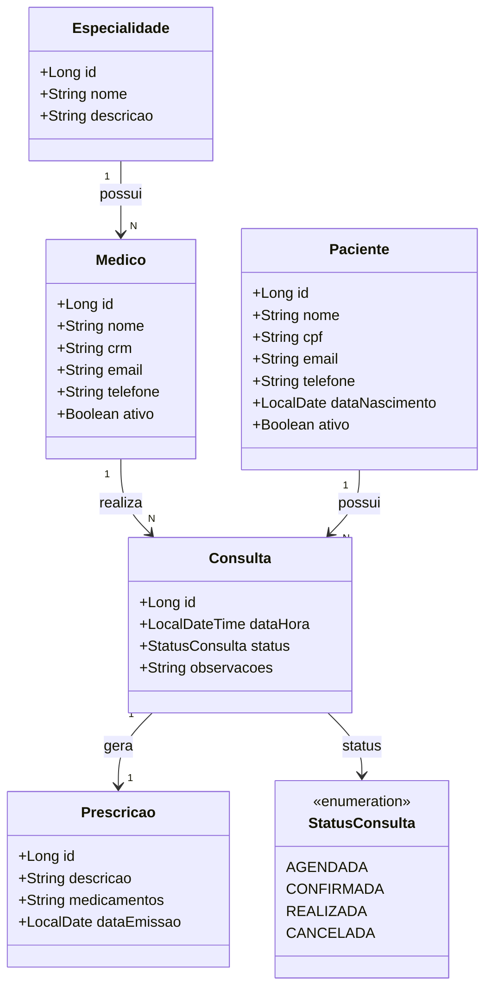

# Desafio Técnico — API REST com Spring Boot

## Contexto do Sistema

Você irá desenvolver a API de um **Sistema de Gestão de Clínica Médica**. O sistema permite o cadastro de médicos e pacientes, o agendamento de consultas e a emissão de prescrições médicas, simulando o back-end de um software de gestão clínica do dia a dia corporativo.

---

## Modelagem do Domínio

O sistema possui **cinco entidades principais** com os seguintes relacionamentos:

### Entidades

| Entidade | Descrição |
|---|---|
| `Especialidade` | Especialidade médica (ex.: Cardiologia, Dermatologia, Ortopedia) |
| `Medico` | Médico da clínica, vinculado a uma especialidade |
| `Paciente` | Paciente cadastrado na clínica |
| `Consulta` | Agendamento de consulta entre um médico e um paciente |
| `Prescricao` | Prescrição médica emitida ao final de uma consulta |

### Diagrama de Relacionamentos

```
Especialidade (1) ──── (N) Medico
Medico        (1) ──── (N) Consulta
Paciente      (1) ──── (N) Consulta
Consulta      (1) ──── (1) Prescricao
```

### Diagrama de Classes



### Status de Consulta

O campo `status` da entidade `Consulta` deve seguir o fluxo abaixo (use um `enum`):

```
AGENDADA → CONFIRMADA → REALIZADA
                 └──────→ CANCELADA
```

Transições inválidas devem ser rejeitadas pela camada de serviço.

---

## Banco de Dados

- Utilize **MySQL** como banco de dados relacional.
- Configure a conexão em `application.properties` (ou `application.yml`).
- Use **Spring Data JPA / Hibernate** para o mapeamento ORM.
- Inclua um script `src/main/resources/data.sql` com dados iniciais (seed) suficientes para demonstrar o funcionamento de todos os endpoints.

---

## Fase 1 — CRUD Básico

### Objetivo

Implementar a estrutura completa do projeto com as camadas `model`, `repository`, `service` e `controller`, expondo um CRUD para cada entidade via API REST, com uso de DTOs para entrada e saída de dados.

### Estrutura de pacotes sugerida

```
com.clinica.gestao
├── controller
├── dto
│   ├── request
│   └── response
├── exception
├── model
│   └── enums
├── repository
└── service
```

### Para cada entidade, implemente

- **Model**: mapeamento JPA com anotações (`@Entity`, `@Table`, `@Id`, `@GeneratedValue`, relacionamentos).
- **Repository**: interface estendendo `JpaRepository`.
- **DTOs**:
  - `*RequestDTO`: dados recebidos na requisição — **nunca exponha a entidade diretamente**.
  - `*ResponseDTO`: dados retornados na resposta — **nunca exponha a entidade diretamente**.
- **Service**: lógica de negócio, conversão entre DTO e entidade, chamadas ao repository.
- **Controller**: endpoints REST com os verbos HTTP adequados.

### Endpoints mínimos por entidade

| Método | Endpoint | Descrição |
|---|---|---|
| `POST` | `/api/{entidade}` | Criar registro |
| `GET` | `/api/{entidade}` | Listar todos |
| `GET` | `/api/{entidade}/{id}` | Buscar por ID |
| `PUT` | `/api/{entidade}/{id}` | Atualizar |
| `DELETE` | `/api/{entidade}/{id}` | Remover |

### Regras de negócio obrigatórias (camada Service)

1. **Especialidade**: não pode ser excluída se houver médicos vinculados a ela.
2. **Médico**: não pode ser excluído se possuir consultas com status `AGENDADA` ou `CONFIRMADA`. O campo `crm` deve ser único no sistema.
3. **Paciente**: não pode ser excluído se possuir consultas com status `AGENDADA` ou `CONFIRMADA`. O campo `cpf` deve ser único no sistema.
4. **Consulta**: não pode ser agendada se o médico já possuir outra consulta com status `AGENDADA` ou `CONFIRMADA` no mesmo horário (`dataHora`). Não pode ser agendada para datas passadas. Somente consultas com status `REALIZADA` podem receber uma prescrição.
5. **Prescrição**: não pode ser criada ou alterada se a consulta vinculada não estiver com status `REALIZADA`.

---

## Fase 2 — Busca, Validação, Exceções e Segurança

### Objetivo

Evoluir a API com endpoints de busca avançada, validação de entrada, tratamento centralizado de erros e autenticação via JWT.

### 2.1 — Endpoints de Busca (Finder Methods)

Implemente os seguintes endpoints usando **finder methods** do Spring Data JPA, sem JPQL ou SQL nativo:

| Método | Endpoint | Descrição |
|---|---|---|
| `GET` | `/api/medicos/especialidade/{especialidadeId}` | Listar médicos por especialidade |
| `GET` | `/api/consultas/medico/{medicoId}` | Listar consultas de um médico |
| `GET` | `/api/consultas/paciente/{pacienteId}` | Listar consultas de um paciente |
| `GET` | `/api/consultas/status/{status}` | Listar consultas por status |
| `GET` | `/api/consultas/medico/{medicoId}/status/{status}` | Listar consultas de um médico por status |
| `GET` | `/api/consultas/data` | Listar consultas em uma data específica (parâmetro `?data=yyyy-MM-dd`) |
| `GET` | `/api/prescricoes/consulta/{consultaId}` | Buscar prescrição de uma consulta |

### 2.2 — Validação com Spring Validation

Adicione a dependência `spring-boot-starter-validation`, anote os `*RequestDTO` com as restrições adequadas e use `@Valid` nos controllers.

Exemplos de validações esperadas:

| Campo | Validação sugerida |
|---|---|
| `Especialidade.nome` | `@NotBlank`, `@Size(min=3, max=100)` |
| `Medico.crm` | `@NotBlank`, `@Pattern` (formato CRM) |
| `Medico.email` | `@NotBlank`, `@Email` |
| `Paciente.cpf` | `@NotBlank`, `@CPF` ou `@Pattern` |
| `Paciente.dataNascimento` | `@NotNull`, `@Past` |
| `Consulta.dataHora` | `@NotNull`, `@Future` |
| `Prescricao.descricao` | `@NotBlank`, `@Size(min=10, max=1000)` |

### 2.3 — Tratamento de Exceções

Implemente um `@RestControllerAdvice` centralizado que trate, no mínimo:

| Situação | HTTP Status |
|---|---|
| Entidade não encontrada | `404 Not Found` |
| Violação de regra de negócio | `422 Unprocessable Entity` |
| Falha de validação (`@Valid`) | `400 Bad Request` |
| Acesso negado (Spring Security) | `403 Forbidden` |
| Token ausente ou inválido | `401 Unauthorized` |

O corpo da resposta de erro deve ser padronizado. Sugestão de estrutura:

```json
{
  "timestamp": "2025-01-01T10:30:00",
  "status": 404,
  "error": "Recurso não encontrado",
  "message": "Médico com id 42 não encontrado",
  "path": "/api/medicos/42"
}
```

Para erros de validação, retorne a lista de campos com problema:

```json
{
  "timestamp": "2025-01-01T10:30:00",
  "status": 400,
  "error": "Erro de validação",
  "fields": [
    { "field": "crm", "message": "não deve estar em branco" },
    { "field": "email", "message": "deve ser um endereço de e-mail válido" }
  ]
}
```

### 2.4 — Autenticação com Spring Security e JWT

#### Fluxo de autenticação

- Utilize **Spring Security** com autenticação **stateless** via **JWT**.
- As senhas devem ser armazenadas com **BCrypt**.
- O token deve conter, no mínimo, o `sub` (e-mail do usuário) e o `role` (perfil).
- O tempo de expiração deve ser configurável via `application.properties`.

#### Endpoints públicos (sem autenticação)

| Método | Endpoint | Descrição |
|---|---|---|
| `POST` | `/api/auth/register` | Cadastrar novo usuário do sistema |
| `POST` | `/api/auth/login` | Autenticar e obter token JWT |

#### Regras de autorização

| Perfil | Permissões |
|---|---|
| `ADMIN` | Acesso total a todos os endpoints |
| `RECEPCIONISTA` | Leitura geral; criação, atualização e cancelamento de `Consulta`; criação e atualização de `Paciente` |
| `MEDICO` | Leitura geral; atualização de status de `Consulta`; criação e atualização de `Prescricao` |

> **Dica**: utilize `@PreAuthorize` ou a configuração do `SecurityFilterChain` para aplicar as regras acima.

---

## Requisitos Técnicos

- **Java 17+**
- **Spring Boot 3.x**
- **Spring Data JPA**
- **Spring Validation**
- **Spring Security**
- **MySQL 8+**
- **Maven** ou **Gradle**
- Biblioteca JWT de sua preferência (ex.: `jjwt`, `java-jwt` da Auth0)

---

## Critérios de Avaliação

### Fase 1
- Modelagem correta das entidades e relacionamentos JPA
- Separação de responsabilidades entre as camadas
- Uso adequado de DTOs (sem expor entidades diretamente)
- Implementação correta das regras de negócio no service

### Fase 2
- Finder methods corretos e sem uso desnecessário de JPQL ou SQL nativo
- Validações consistentes nos DTOs
- Tratamento de exceções centralizado com respostas padronizadas
- Configuração correta do Spring Security e fluxo JWT funcional
- Aplicação das regras de autorização por perfil

### Bônus (não obrigatório)
- Testes unitários da camada service com JUnit 5 e Mockito
- Testes de integração dos controllers com MockMvc
- Documentação da API com Springdoc OpenAPI (Swagger UI)
- Uso de paginação (`Pageable`) nos endpoints de listagem
- Docker Compose com os serviços da aplicação e do MySQL

---

## Como Entregar

1. Faça um **fork** deste repositório.
2. Desenvolva o desafio na branch `main` do seu fork (ou crie uma branch `develop` e abra o PR para `main`).
3. Ao finalizar, abra um **Pull Request** do seu fork para este repositório com o título:

   ```
   [Desafio] Seu Nome Completo
   ```

4. No corpo do Pull Request, descreva brevemente:
   - As decisões técnicas que tomou
   - O que foi implementado em cada fase
   - Como executar o projeto localmente (pré-requisitos, configuração do banco, comando de execução)
   - Pontos de melhoria que ficaram de fora por limitação de tempo

> **Prazo**: conforme combinado com o recrutador.

---

## Executando Localmente (exemplo de configuração)

```properties
# src/main/resources/application.properties

spring.datasource.url=jdbc:mysql://localhost:3306/clinica_gestao?createDatabaseIfNotExist=true
spring.datasource.username=root
spring.datasource.password=sua_senha

spring.jpa.hibernate.ddl-auto=update
spring.jpa.show-sql=true

api.security.token.secret=seu_segredo_jwt
api.security.token.expiration=86400000
```

```bash
# Clonar e executar
git clone https://github.com/<seu-usuario>/<seu-fork>.git
cd <seu-fork>
./mvnw spring-boot:run
```

---

Bom desafio! 🚀

---

## Autor

**Prof. Alexandre Junior**

[](https://instagram.com/profalexandrejunior)
[](https://t.me/profalexandrejunior)
[](https://youtube.com/@profalexandrejunior)
